# Mindstream User Flows (Visual Map)

This document visualizes every user interaction path within Mindstream using Mermaid flowcharts.

## 1. Authentication Flow
This flow covers the initial app load, session checking, and login process via Magic Link or OAuth.

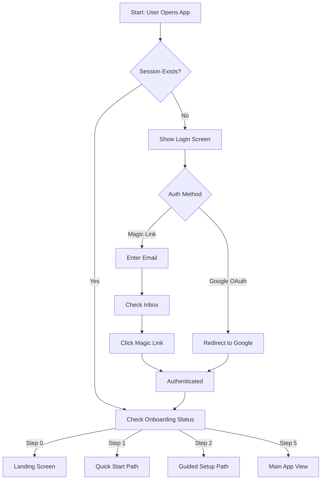

## 2. Onboarding Flows
Two distinct paths for new users: Quick Start (fast) and Guided Setup (thorough).

### 2.1 Landing Decision
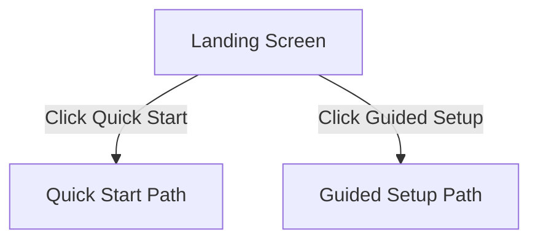

### 2.2 Quick Start Path
Designed for users who want to jump straight in.

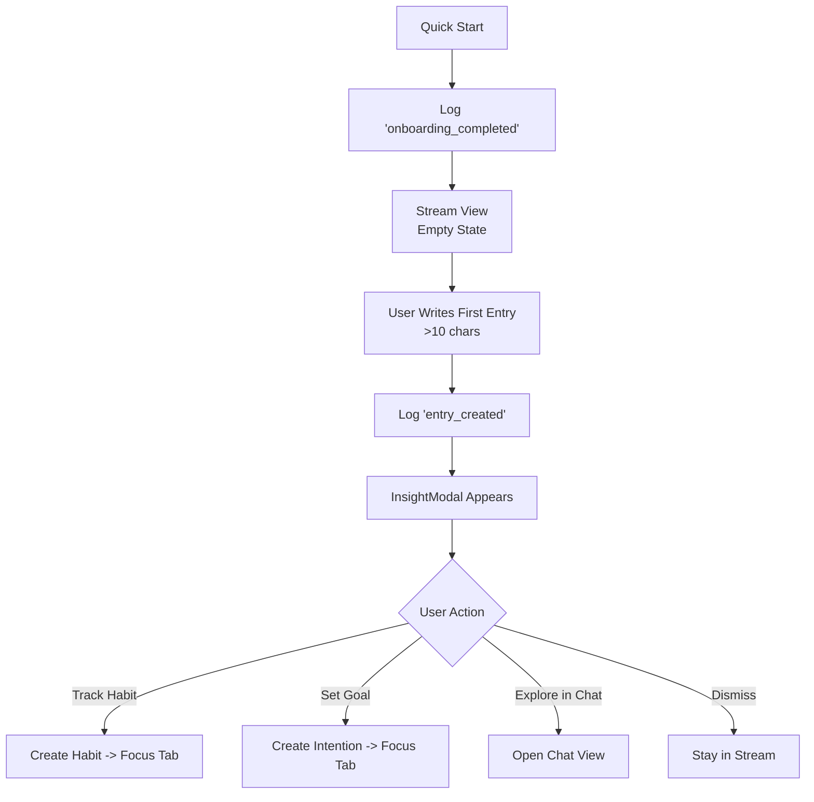

### 2.3 Guided Setup Path
A 7-step wizard to calibrate the AI and user intent.

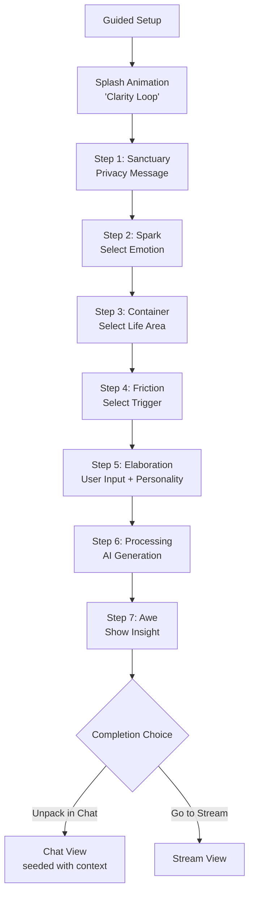

## 3. Stream View Flows
The central feed of thoughts, insights, and actions.

### 3.1 Entry Creation & Management
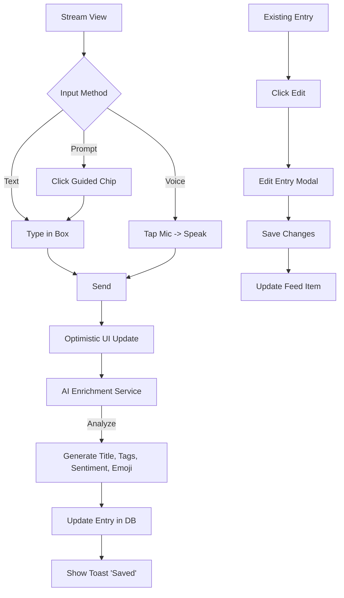

### 3.2 Feed Interaction
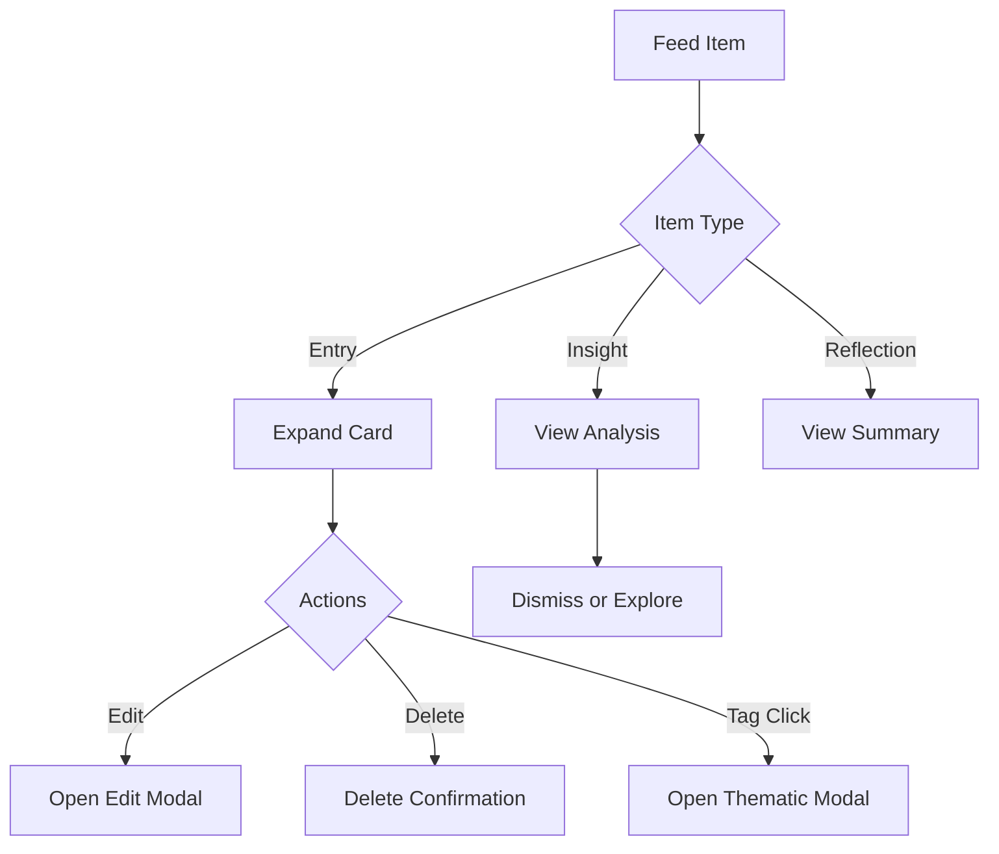

## 4. Focus View Flows
Managing behavioral systems (Habits) and finite goals (Intentions).

### 4.1 Habit Management
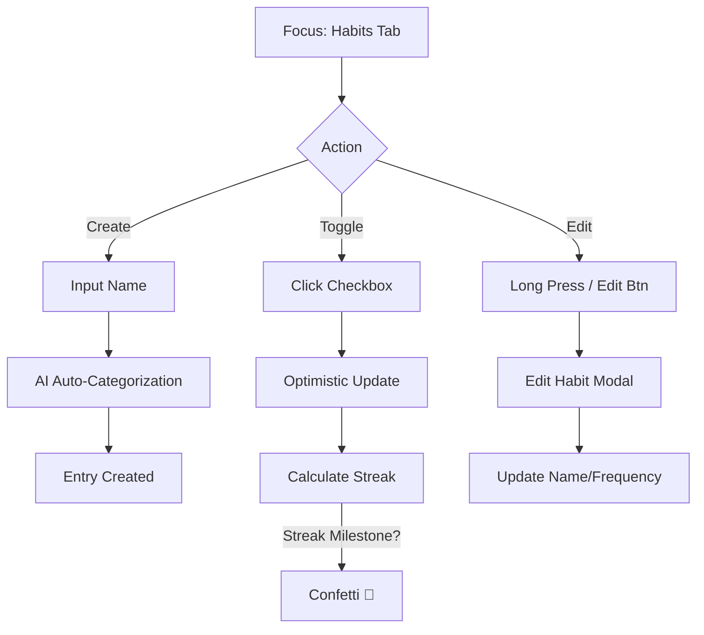

### 4.2 Intention (Goal) Management
```mermaid
graph TD
    A[Focus: Goals Tab] --> B{Action}
    
    B -->|Create| C[Input Text]
    C --> D[Select Deadline (ETA)]
    D --> E[AI Auto-Tagging]
    E --> F[Add to List (Sorted by Urgency)]
    
    B -->|Complete| G[Click Checkbox]
    G --> H[Move to Completed Section]
    
    B -->|Edit| I[Click Pencil]
    I --> J[Edit Intention Modal]
```

## 5. Insights View Flows
Progressive disclosure of analysis and patterns.

### 5.1 Reflection Generation
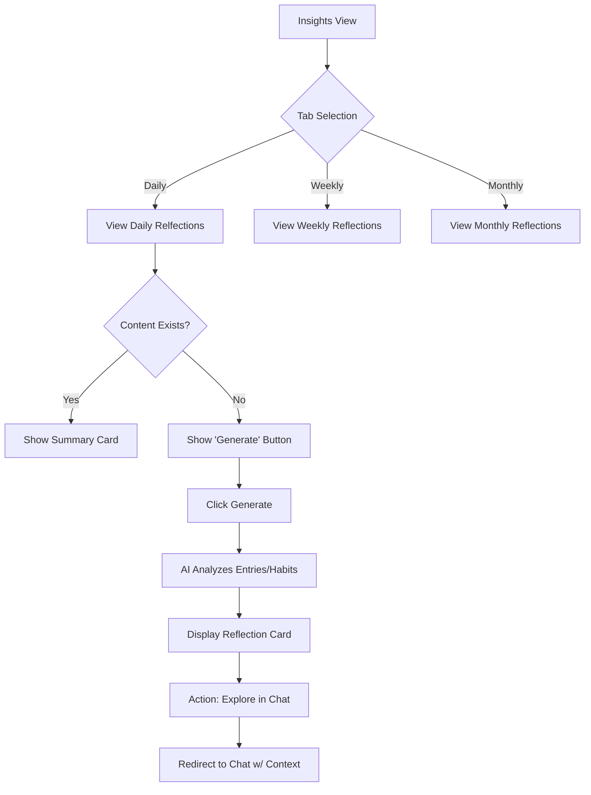

### 5.2 Deep Dive (Life Areas)
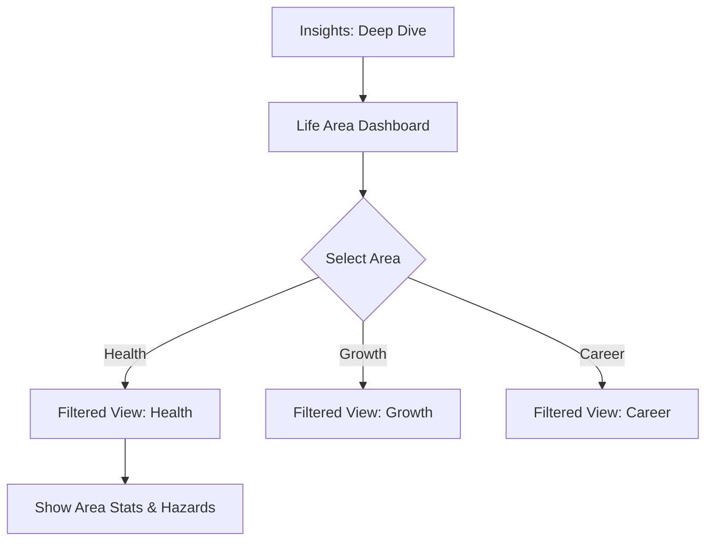

## 6. Chat View Flows
Conversational intelligence and memory.

### 6.1 Chat Interaction
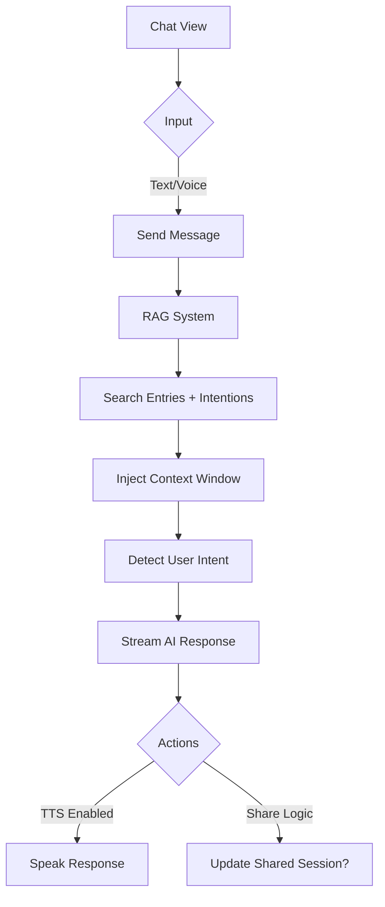

### 6.2 Chat Takeaways
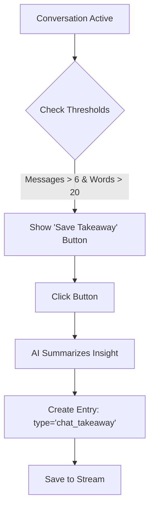

## 7. Settings & Modals
Cross-cutting concerns and configuration.

### 7.1 Search & Thematic Analysis
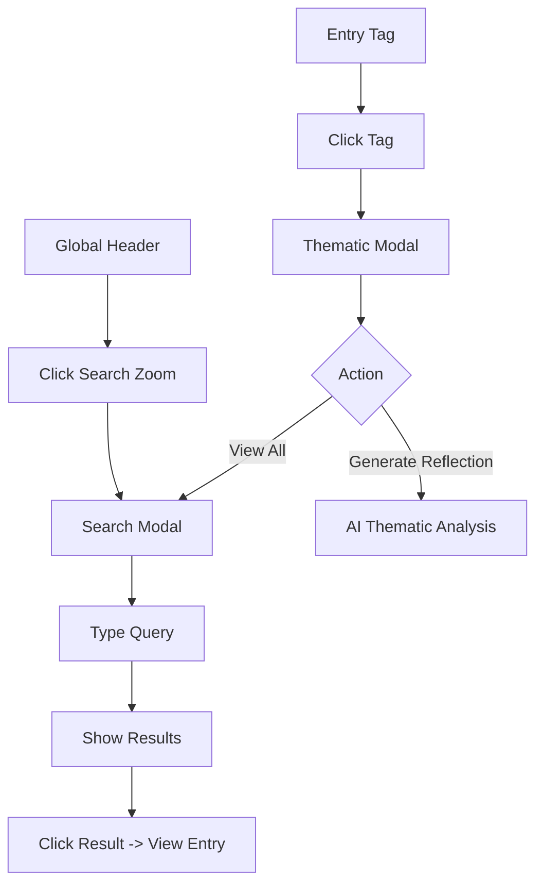

### 7.2 Settings & Data
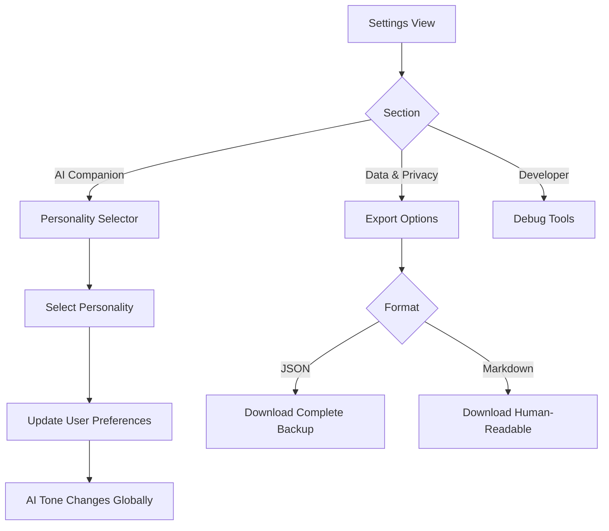


